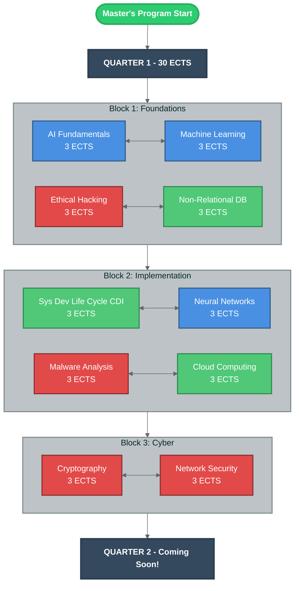

# Program Path Visualization

### **Color Legend:**
- 🔵 **Blue**: AI/Machine Learning courses
- 🔴 **Red**: Cybersecurity courses  
- 🟢 **Green**: Software Engineering/IoT courses

```mermaid
%%{init: {'theme':'base', 'themeVariables': { 'primaryColor':'#e1f5ff','primaryTextColor':'#000','primaryBorderColor':'#333','lineColor':'#666','secondaryColor':'#d4edda','tertiaryColor':'#f8d7da'}}}%%
flowchart TD
    Start([Master's Program Start]) --> S1_Intro[QUARTER 1 - 30 ECTS]
    
    S1_Intro --> Block1
    
    subgraph Block1["Block 1: Foundations"]
        direction LR
        B1_AI["AI Fundamentals 
        3 ECTS"]:::ai <-->

        B1_ML["Machine Learning
        3 ECTS"]:::ai

        B1_C["Ethical Hacking
        3 ECTS"]:::cyber <-->

        B1_S["Non-Relational DB
        3 ECTS"]:::soft

    end
    
    Block1 --> Block2
    
    subgraph Block2["Block 2: Implementation"]
        direction LR
        B2_S2["Sys Dev Life Cycle CDI
        3 ECTS"]:::soft <-->

        B2_AI["Neural Networks
        3 ECTS"]:::ai 

        B2_C["Malware Analysis
        3 ECTS"]:::cyber <-->

        B2_S["Cloud Computing
        3 ECTS"]:::soft

    end
    
    Block2 --> Block3
    
    subgraph Block3["Block 3: Cyber"]
        direction LR
        B3_C["Cryptography
        3 ECTS"]:::cyber <-->

        B3_C2["Network Security
        3 ECTS"]:::cyber
    end
    
    Block3 --> S2_Intro[QUARTER 2 - Coming Soon!]

    %% Styling for course types
    classDef ai fill:#4A90E2,stroke:#2E5C8A,stroke-width:2px,color:#fff
    classDef cyber fill:#E24A4A,stroke:#8A2E2E,stroke-width:2px,color:#fff
    classDef soft fill:#50C878,stroke:#2E8A4F,stroke-width:2px,color:#fff
    classDef semester fill:#34495E,stroke:#2C3E50,stroke-width:3px,color:#fff,font-weight:bold
    
    class S1_Intro,S2_Intro semester
    
    style Start fill:#2ECC71,stroke:#27AE60,stroke-width:3px,color:#fff,font-weight:bold
    style Block1 fill:#BDC3C7,stroke:#7F8C8D,stroke-width:2px
    style Block2 fill:#BDC3C7,stroke:#7F8C8D,stroke-width:2px
    style Block3 fill:#BDC3C7,stroke:#7F8C8D,stroke-width:2px
```
